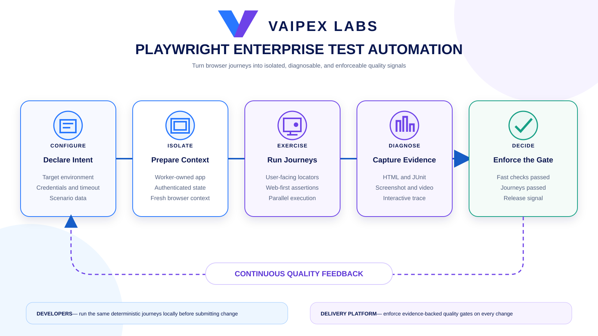
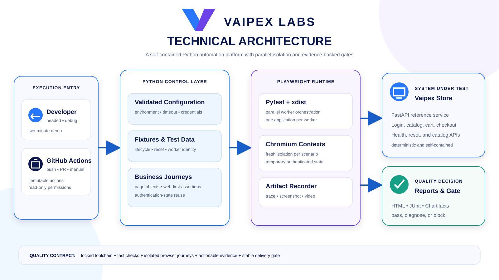

# Vaipex Playwright Enterprise Test Automation Foundation

An open reference implementation for delivering reliable, maintainable, and
operable browser automation with Playwright and Python. It gives development
and quality engineering teams one supported way to configure, execute,
diagnose, and govern browser journeys locally and in continuous integration.

Developed by **Vaipex Labs** for the developer and quality engineering
communities.


[](https://github.com/vaipexlabs/playwright-lab-01-enterprise-test-automation-foundation/actions/workflows/quality-gates.yaml)

[What It Delivers](#what-it-delivers) ·
[How It Works](#how-it-works) ·
[Architecture](#architecture) ·
[Two-Minute Demo](#two-minute-demo) ·
[Run Modes](#run-modes) ·
[Failure Evidence](#failure-evidence) ·
[Continuous Integration](#continuous-integration) ·
[Operate and Extend](#operate-and-extend)

## What It Delivers

- A deterministic FastAPI storefront owned by the test suite.
- Business-readable browser journeys backed by reusable page objects.
- Validated configuration, deterministic test data, and reusable fixtures.
- Worker-owned applications and fresh browser contexts for parallel isolation.
- Authentication-state reuse without committing credentials or session data.
- Web-first assertions and stable, user-facing locators.
- Failure-only screenshots, traces, and videos plus HTML and JUnit reports.
- One quality contract for workstations, pull requests, and the main branch.
- Pinned dependencies, read-only CI permissions, and automated update proposals.

## How It Works

A developer declares the environment and scenario intent. The foundation
creates an isolated context, exercises the customer journey, captures
actionable evidence, and turns the result into a delivery quality decision.



## Architecture

Developers and GitHub Actions invoke the same Python control layer. Pytest and
xdist orchestrate isolated Playwright contexts against the self-contained
Vaipex Store, while the artifact recorder supplies reports and diagnostics to
a stable quality gate.



## Two-Minute Demo

Prerequisites are Python 3.12 and network access for the first dependency and
browser download. Clone the repository and run:

```bash
./scripts/two-minute-demo.sh
```

The demo:

1. Reconciles and verifies the fully pinned Python toolchain.
2. Enforces formatting and lint rules and runs 10 fast contract tests.
3. Runs four isolated Chromium journeys across two parallel workers.
4. Verifies the HTML and JUnit evidence and prints the quality decision.

A warm run completes in about two minutes; the first run may take longer while
Chromium and Python dependencies are downloaded. Open the resulting report:

```bash
open reports/playwright.html          # macOS
xdg-open reports/playwright.html      # Linux
```

## Reference Application

The repository includes **Vaipex Store**, a compact commerce application built
for deterministic automation. It provides login, catalog search, cart,
checkout, confirmation, health, catalog, and test-only reset interfaces.
Owning the target avoids external-site changes, rate limits, and shared data.

Explore it manually:

```bash
./scripts/start-app.sh
```

Open [http://127.0.0.1:8000](http://127.0.0.1:8000) and use the local demo
identity `demo@vaipex.io` with password `vaipex-demo`. Stop it with `Ctrl+C`.

## Run Modes

```bash
# Fast headless execution with two parallel workers
./scripts/test-e2e.sh

# Watch the journeys in Chromium
./scripts/test-e2e.sh --headed

# Pause and inspect with Playwright Inspector
./scripts/test-e2e.sh --debug
```

Headed mode adds a visible 500 ms delay. Change the display speed or headless
concurrency without editing code:

```bash
PLAYWRIGHT_SLOW_MO=1000 ./scripts/test-e2e.sh --headed
PLAYWRIGHT_WORKERS=4 ./scripts/test-e2e.sh
```

The four independent scenarios cover rejected credentials, a complete
sign-in-to-checkout journey, authenticated catalog search, and an authenticated
purchase. Every worker owns its application and data, so parallel execution is
repeatable.

Point the same suite at a compatible environment:

```bash
VAIPEX_BASE_URL=https://store.example.test \
VAIPEX_DEMO_EMAIL=automation@example.test \
VAIPEX_DEMO_PASSWORD='replace-me' \
./scripts/test-e2e.sh
```

## Test Design

| Layer | Responsibility |
| --- | --- |
| `tests/e2e/` | Express customer outcomes as browser journeys |
| `tests/pages/` | Encapsulate stable locators, interactions, and assertions |
| `tests/e2e/conftest.py` | Manage applications, reset state, and authenticated contexts |
| `tests/config.py` | Validate environment, credentials, and timeouts |
| `tests/data.py` | Generate deterministic, worker-specific scenario data |
| `tests/conftest.py` | Configure browser pages and shared data fixtures |

Authentication occurs once per worker. Each authenticated test receives a
fresh browser context initialized from temporary storage state. Nothing is
written into the repository, and scenario identities remain distinct across
parallel workers.

## Failure Evidence

Normal runs produce `reports/playwright.html` and `reports/junit.xml`.
Playwright retains these additional diagnostics only for failed tests:

| Evidence | Diagnostic value |
| --- | --- |
| Screenshot | Final visible browser state |
| Trace | Replayable actions, DOM, console, network, and timing |
| Video | Complete failed browser journey |
| HTML report | Human-readable suite result |
| JUnit XML | Machine-readable quality result |

Prove the evidence pipeline safely:

```bash
./scripts/demonstrate-failure.sh
.venv/bin/playwright show-trace path/to/trace.zip
```

The demonstration succeeds only when its intentional assertion failure creates
all five evidence types. Generated evidence is ignored by Git.

## Continuous Integration

Run the complete delivery gate locally:

```bash
./scripts/quality-gate.sh
```

GitHub Actions applies the same contract to pushes, pull requests, and manual
runs:

| Job | Enforced gate |
| --- | --- |
| Fast Quality Gate | Locked setup, formatting, linting, and 10 fast tests |
| Browser Quality Gate | Chromium plus four parallel browser journeys |
| Quality Gate | One stable required-check result across both jobs |

Reports are retained for 14 days, and browser diagnostics are uploaded on
failure. Workflow permissions are read-only, actions are pinned to immutable
commit SHAs, redundant branch runs are cancelled, and Dependabot proposes
grouped weekly dependency updates.

## Toolchain

| Tool | Role |
| --- | --- |
| Python | Automation language |
| FastAPI | Deterministic reference application |
| Playwright for Python | Browser automation runtime |
| Pytest | Test runner, fixtures, markers, and assertions |
| pytest-xdist | Parallel worker orchestration |
| Ruff | Formatting and linting |
| pytest-html and JUnit XML | Human and machine-readable reporting |
| GitHub Actions | Continuous quality-gate enforcement |

Direct dependencies are declared in `pyproject.toml`; the complete transitive
environment is pinned in `requirements.lock`.

## Operate and Extend

The [operating guide](docs/operations.md) covers execution modes, compatible
environments, evidence handling, troubleshooting, security, and the supported
way to extend the suite.

```text
src/vaipex_store/   Deterministic FastAPI application
scripts/            Setup, execution, demonstration, and quality-gate commands
.github/             CI quality gate and dependency automation
docs/                Operating guidance and Vaipex illustrations
tests/unit/          Fast application and configuration contracts
tests/e2e/           Business-readable Playwright journeys
tests/pages/         Reusable page interactions and UI assertions
tests/config.py      Validated environment configuration
tests/data.py        Deterministic, parallel-safe scenario data
tests/conftest.py    Shared browser and data fixtures
```

## Contributing

Community contributions are welcome. Keep changes portable, deterministic,
secure by default, and understandable to teams adopting the reference
implementation.

Licensed under the [Apache License 2.0](LICENSE).
